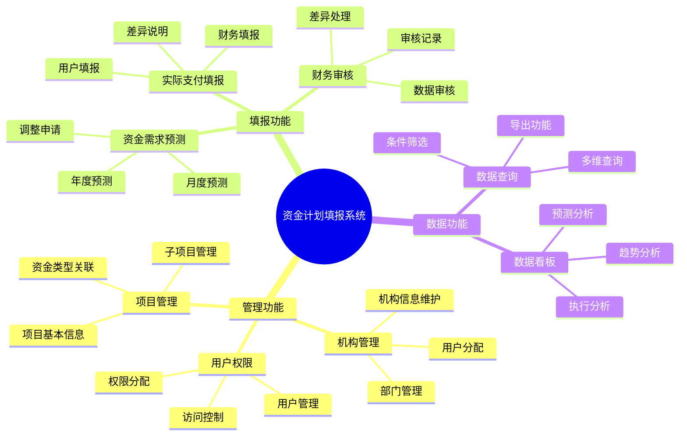
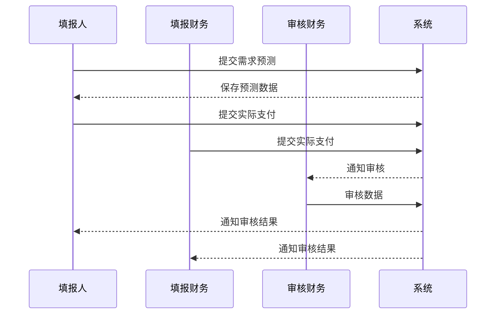
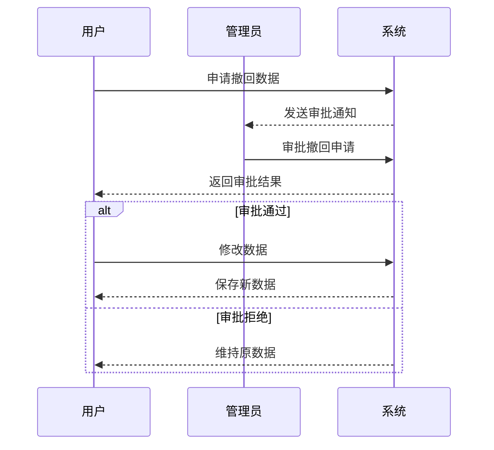

# 资金计划填报系统功能说明文档
**版本**: 1.2
**更新日期**: 2024-02-24

## 一、系统功能地图


## 二、功能模块说明

### 1. 管理功能

#### 1.1 机构管理
- **功能入口**: 系统管理 > 机构管理
- **操作角色**: 管理员
- **功能流程**:
  1. 新增机构
     - 点击"新增机构"按钮
     - 填写机构名称和编码
     - 添加项目专班/部门
       - 点击"+ 新增项目专班/部门"
       - 输入专班/部门信息
     - 保存机构信息
  2. 编辑机构
     - 在机构列表中选择目标机构
     - 修改机构信息和专班/部门信息
     - 保存更改
  3. 删除机构
     - 仅允许删除未关联项目的机构
     - 删除前需确认

#### 1.2 资金需求类型管理
- **功能入口**: 系统管理 > 资金需求类型管理
- **操作角色**: 管理员
- **功能流程**:
  1. 新增资金需求类型
     - 点击"新增资金需求类型"按钮
     - 输入类型名称
     - 保存类型信息
  2. 编辑资金需求类型
     - 修改类型信息
     - 保存更改
  3. 删除资金需求类型
     - 仅允许删除未关联项目的类型

#### 1.3 项目管理
- **功能入口**: 系统管理 > 项目管理
- **操作角色**: 管理员
- **功能流程**:
  1. 新增项目
     - 点击"新增项目"按钮
     - 填写项目基本信息
     - 选择关联机构（支持多选）
     - 选择机构的项目专班/部门（支持多选）
     - 添加子项目
       - 点击"+ 新增子项目"
       - 为子项目关联资金需求类型
     - 保存项目信息
  2. 编辑项目
     - 修改项目信息
     - 更新机构关联
     - 管理子项目
  3. 项目归档
     - 设置项目状态为归档
     - 归档后项目不可编辑
  4. 删除项目
     - 仅允许删除未提交过信息的空项目（待完成）

### 数据约束
- 项目名称必须唯一（机构内）
- 子项目必须关联有效父项目
- 项目状态变更需记录审计日志（待完成）

### 2. 填报功能

#### 2.1 资金需求预测填报
- **功能入口**: 资金填报 > 需求预测
- **操作角色**: 填报人
- **功能流程**:
  1. 选择填报项目
     - 筛选显示本机构未归档项目
     - 支持按机构、部门、项目名称/项目编码等筛选
     - 支持多选项目
  2. 填报数据
     - 表格化展示填报界面，按机构和项目名称分组
     - 表头为机构、项目名称、子项目、资金需求类型
     - 默认显示当年汇总数据和前3个月提交的数据明细（不可编辑）
     - 仅能填报下月数据（相对当前日期的下个月）
     - 支持多人填报同一记录
  3. 保存与提交
     - 自动保存草稿
     - 提交前数据校验
     - 提交后锁定数据
     - 支持撤回申请（需管理员审核）

#### 2.2 实际支付填报
- **功能入口**: 资金填报 > 实际支付
- **操作角色**: 填报人、填报财务
- **功能流程**:
  1. 填报人填报
     - 选择已提交预测的项目
     - 填报上月实际支付
     - 提交数据
  2. 财务填报
     - 查看分配项目
     - 独立填报实际支付
     - 提交数据
  3. 数据管理
     - 支持保存草稿
     - 提交后锁定
     - 支持撤回申请（需管理员审核）

#### 2.3 财务审核
- **功能入口**: 资金填报 > 财务审核
- **操作角色**: 审核财务
- **功能流程**:
  1. 选择审核项目
     - 显示双方已提交项目
     - 支持批量选择
  2. 数据审核
     - 自动比对填报数据差异
     - 自动标注不一致数据
     - 支持筛选不一致记录
     - 手动处理不一致数据
  3. 审核完成
     - 提交审核结果
     - 生成审核记录

### 3. 数据功能

#### 3.1 数据查询
- **功能入口**: 数据分析 > 数据查询
- **操作权限**: 按角色控制查询范围
- **功能特点**:
  1. 拖拽式查询
     - 维度拖拽（年、月、机构、专班/部门等）
     - 指标选择
     - 条件筛选
  2. 数据维度
     - 记录归属年月
     - 机构信息
     - 项目信息
     - 状态信息
     - 操作人信息
  3. 数据展示
     - 表格展示查询结果数据
     - 支持导出为Excel
     - 支持导出为CSV
  4. 权限控制
     - 填报人：仅查看自身数据
     - 填报财务：查看负责机构数据
     - 审核财务：查看负责机构数据
     - 管理员：查看所有数据
     - 观察员：查看负责机构数据

#### 3.2 数据看板
- **功能入口**: 数据分析 > 数据看板
- **操作权限**: 按角色控制数据范围
- **功能特点**:
  1. 图表类型
     - 折线图
     - 柱形图
     - KPI卡片
     - 条形图
     - 饼图
  2. 看板配置
     - 添加图表
     - 设置标题和描述
     - 数据源配置
     - 样式设置
  3. 布局管理
     - 卡片式布局
     - 自定义卡片大小
     - 拖拽位置调整
     - 样式定制

### 4. 系统设置

#### 4.1 时间设置
- 需求预测填报截止日（1-30号可选）
- 实际支付填报截止日（1-30号可选）
- 过期处理机制
  - 需提交延期申请
  - 管理员审核

#### 4.2 人员设置
- 填报财务配置
- 审核财务配置
- 机构权限分配

#### 4.3 权限管理
- 机构数据隔离
- 角色权限配置
- 数据访问控制

#### 4.4 文件管理
- 支持上传格式: PDF/XLSX/DOCX/图片
- 单个文件大小限制: ≤50MB
- 存储期限: 根据项目周期自动清理

## 三、关键交互流程

### 1. 填报流程


### 2. 数据修改流程


## 四、系统配置项

### 1. 时间设置
- 需求预测填报截止日
- 实际支付填报截止日
- 数据自动归档时间

### 2. 数据规则
- 金额输入限制
- 数据变动预警阈值
- 审核规则配置

### 3. 通知设置
- 填报提醒
- 审核提醒
- 截止日期提醒

## 五、常见问题处理

### 1. 数据填报问题
- 截止日期过期处理
- 数据冲突解决
- 批量导入失败处理

### 2. 审核问题
- 数据差异处理
- 撤回申请处理
- 审核结果修正

### 3. 权限问题
- 机构数据隔离
- 角色权限继承
- 临时权限授予

## 用户认证功能

### 1. 登录功能
#### 1.1 功能描述
- 用户通过邮箱和密码进行登录
- 支持表单验证和错误提示
- 登录成功后获取JWT token
- 自动跳转到仪表盘页面

#### 1.2 实现细节
- **前端实现**
  - 使用React Hook Form进行表单管理
  - 使用Zod进行表单验证
  - 使用Sonner显示提示消息
  - 使用localStorage存储token和用户信息

- **后端实现**
  - 使用Prisma进行数据库操作
  - 使用bcryptjs进行密码验证
  - 使用jsonwebtoken生成token
  - 实现完整的错误处理

#### 1.3 用户角色
- 系统管理员 (ADMIN)
  - 拥有所有权限
  - 可以管理其他用户
  - 可以查看所有数据

- 财务人员 (FINANCE)
  - 可以查看和审核财务数据
  - 可以导出财务报表
  - 限定机构范围的数据访问

- 填报人 (REPORTER)
  - 可以提交资金计划
  - 可以查看自己的填报记录
  - 限定个人范围的数据访问

- 审核人员 (AUDITOR)
  - 可以审核资金计划
  - 可以查看审核历史
  - 限定机构范围的数据访问

- 观察者 (OBSERVER)
  - 只读权限
  - 可以查看统计数据
  - 限定机构范围的数据访问

#### 1.4 安全措施
- 密码加密存储
- JWT token认证
- 请求参数验证
- 错误信息脱敏
- 登录失败限制

#### 1.5 测试账户
```typescript
const testAccounts = [
  {
    role: "ADMIN",
    email: "admin@example.com",
    password: "admin123",
    description: "系统管理员账户"
  },
  {
    role: "FINANCE",
    email: "finance@example.com",
    password: "finance123",
    description: "财务主管账户"
  },
  {
    role: "REPORTER",
    email: "reporter@example.com",
    password: "reporter123",
    description: "普通填报员账户"
  },
  {
    role: "AUDITOR",
    email: "auditor@example.com",
    password: "auditor123",
    description: "审核专员账户"
  },
  {
    role: "OBSERVER",
    email: "observer@example.com",
    password: "observer123",
    description: "数据观察员账户"
  }
]
``` 