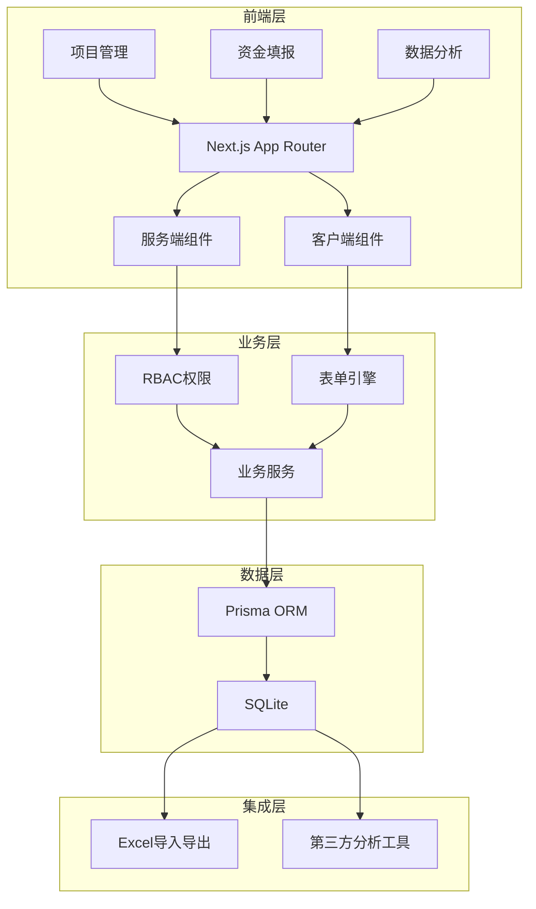
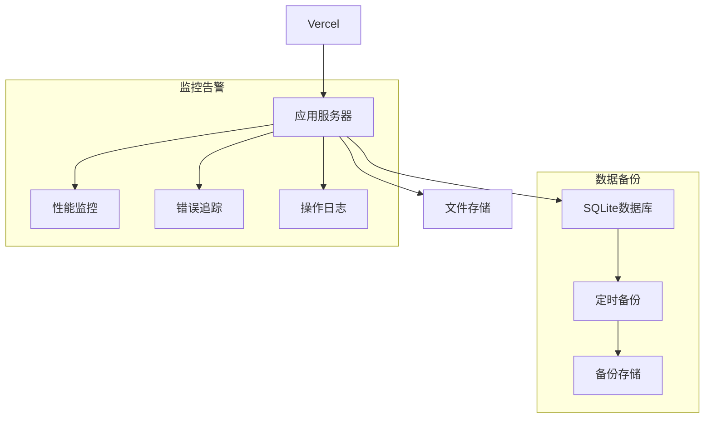

# 系统架构设计文档
**版本**: 2.0
**技术栈**: Next.js 14 + Prisma + SQLite + NextAuth

## 一、系统架构图


## 二、核心模块设计

### 1. 权限控制模块
```typescript
// lib/auth/rbac.ts
interface Permission {
  action: 'create' | 'read' | 'update' | 'delete'
  resource: 'project' | 'record' | 'organization'
  scope: 'all' | 'organization' | 'self'
}

interface Role {
  name: 'admin' | 'reporter' | 'finance' | 'auditor' | 'observer'
  permissions: Permission[]
  organizationId?: string
}

// 权限检查中间件
export function withPermission(permission: Permission) {
  return async function(req: Request) {
    const session = await getServerSession()
    const hasPermission = await checkPermission(session, permission)
    if (!hasPermission) {
      return new Response('Unauthorized', { status: 401 })
    }
  }
}
```

### 2. 表单引擎设计
```typescript
// components/form/FundingForm.tsx
interface FundingFormProps {
  mode: 'predict' | 'actual' | 'audit'
  projects: Project[]
  initialData?: Record[]
}

export function FundingForm({ mode, projects, initialData }: FundingFormProps) {
  // 表单状态管理
  const form = useForm({
    defaultValues: initialData,
    resolver: zodResolver(fundingSchema)
  })

  // 自动保存
  useAutoSave(form, '/api/records/draft')

  // 表格编辑器
  return (
    <DataGrid
      columns={getFundingColumns(mode)}
      data={projects}
      editable={true}
      onSave={handleSave}
      validationRules={fundingValidation}
    />
  )
}
```

### 3. 数据分析模块
```typescript
// lib/analysis/query-builder.ts
interface QueryConfig {
  dimensions: string[]
  metrics: string[]
  filters: Filter[]
  sorting: Sort[]
}

// 动态查询构建器
export class QueryBuilder {
  private config: QueryConfig

  constructor(config: QueryConfig) {
    this.config = config
  }

  async execute() {
    const query = this.buildPrismaQuery()
    return await prisma.$queryRaw(query)
  }

  private buildPrismaQuery() {
    // 构建符合权限的查询
    return prisma.record.findMany({
      where: this.buildFilters(),
      select: this.buildSelection(),
      orderBy: this.buildSorting(),
    })
  }
}
```

## 三、数据库设计优化

### 1. 索引优化
```sql
-- 优化查询性能的索引
CREATE INDEX idx_record_date ON Record(year, month);
CREATE INDEX idx_record_status ON Record(status);
CREATE INDEX idx_record_org ON Record(organizationId);
```

### 2. 查询优化
```typescript
// lib/db/queries.ts
export async function getProjectRecords(projectId: string) {
  return await prisma.record.findMany({
    where: { projectId },
    include: {
      project: {
        select: {
          name: true,
          organization: true
        }
      }
    },
    orderBy: [
      { year: 'desc' },
      { month: 'desc' }
    ]
  })
}
```

## 四、部署架构



## 五、性能优化方案

### 1. 数据加载优化
- 使用服务端组件减少客户端bundle大小
- 实现虚拟滚动处理大量数据
- 按需加载和预加载策略

### 2. 缓存策略
```typescript
// lib/cache/strategy.ts
export const cacheConfig = {
  // 组织架构数据缓存
  organization: {
    ttl: 3600,
    revalidate: 'on-change'
  },
  // 项目配置缓存
  project: {
    ttl: 1800,
    revalidate: 'on-change'
  },
  // 用户权限缓存
  permission: {
    ttl: 300,
    revalidate: 'on-login'
  }
}
```

### 3. 批量操作优化
```typescript
// lib/db/batch.ts
export async function batchUpdateRecords(records: Record[]) {
  const batchSize = 100
  const batches = chunk(records, batchSize)
  
  return await prisma.$transaction(
    batches.map(batch => 
      prisma.record.createMany({
        data: batch,
        skipDuplicates: true
      })
    )
  )
}
```

## 六、监控方案
1. 性能监控
   - 页面加载时间
   - 数据库查询性能
   - API响应时间

2. 错误追踪
   - 前端异常捕获
   - 后端错误日志
   - 数据库异常

3. 业务监控
   - 填报完成率
   - 数据异常预警
   - 系统使用状况

## 七、安全方案
1. 接口安全
   - CSRF防护
   - 请求限流
   - 参数验证

2. 数据安全
   - 数据库备份
   - 操作日志
   - 权限隔离

3. 运维安全
   - 定期备份
   - 监控告警
   - 应急预案