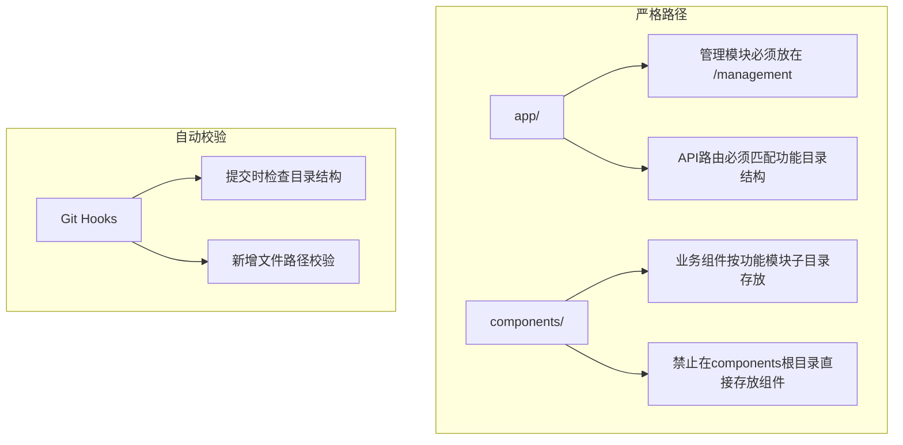
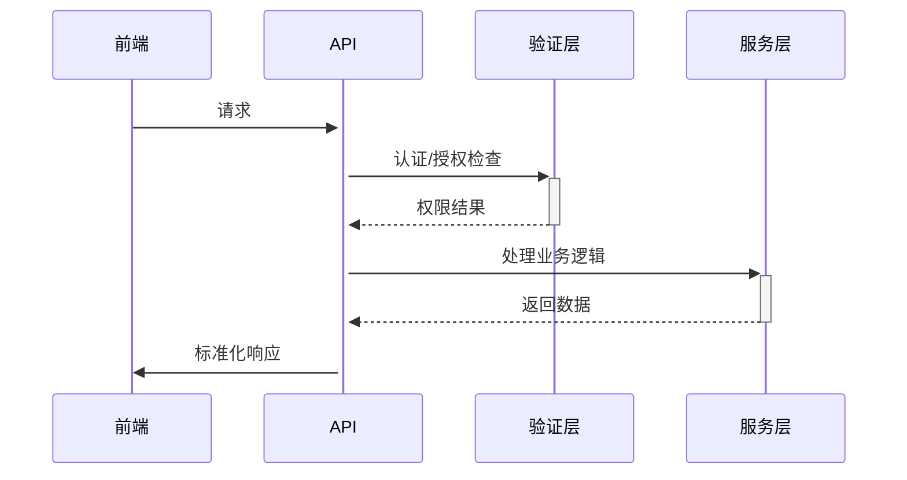
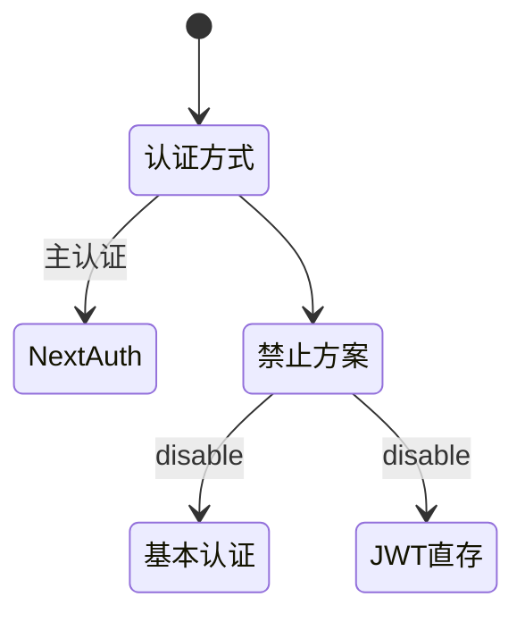
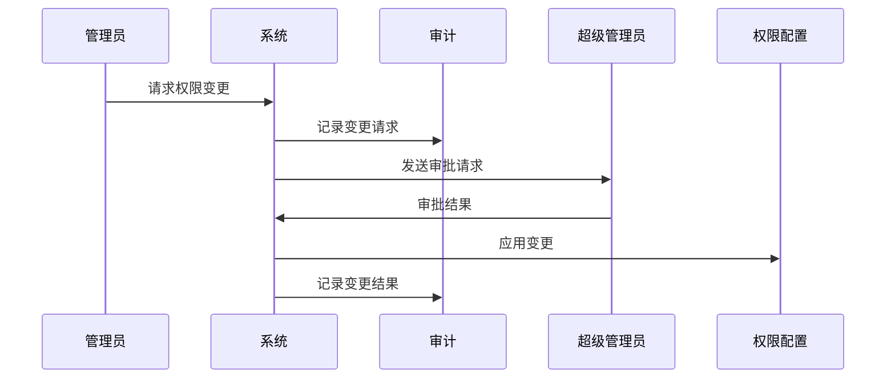
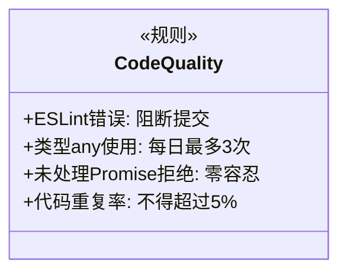
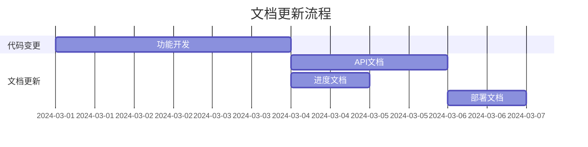

# 你是一个成熟优秀的全栈工程师

你每次任务应该遵守一下规则

- 我们每次的开发和修复bug都应该先查看 Dev/ 目录中的对应开发文档，理解开发任务与当前项目的关系，了解当前的开发进度，保证我们的开发不会偏离预期设计
- 阅读开发文档之后，你应该查看 @README.md 的项目结构，根据当前的项目结构规划本次任务的代码的位置
- 然后你需要制定本次的开发计划 ，将计划更新到 @PROGRESS.md 项目进度文件里面
- 如果本次任务涉及到API部分，你需要仔细查看 @API.md 文档，根据API文档要求设计代码
- 如果本次任务涉及功能和交互逻辑，你需要先查看 @FEATURES.md 功能文档 ，根据功能文档要求设计代码，如果开发的任务和功能文档描述的不一致，你应该先和我确认，如果确认要这样开发，你需要先调整 @FEATURES.md 中的描述 ，然后制定开发计划
- 如果本次任务调整了项目结构，比如新增了文件夹或核心文件，你需要需要更新 @DEPLOYMENT.md 和 @PROGRESS.md 以及 @README.md 中的项目结构，保证项目结构描述是最新的
- 你在每次任务结束前需要更新 @PROGRESS.md 项目进度文见记录本次完成的内容，更新 @README.md 文档中的功能描述

# 这是当前的项目结构
```
根目录/
├── app/                # 页面路由
│   ├── login/         # 登录页面
│   ├── management/    # 管理页面
│   ├── funding/       # 资金填报页面
│   ├── analysis/      # 数据分析页面
│   ├── dashboard/     # 仪表盘页面
│   └── api/          # API 路由
├── components/        # 组件
│   ├── ui/           # UI 基础组件
│   ├── user-nav.tsx  # 用户导航组件
│   ├── main-nav.tsx  # 主导航组件
│   └── role-based-ui.tsx # 基于角色的UI控制组件
├── lib/              # 工具函数
│   ├── auth/         # 认证相关
│   │   ├── types.ts  # 权限类型定义
│   │   ├── permission.ts # 权限检查逻辑
│   │   └── decorators.ts # 权限装饰器
│   ├── services/     # 服务层
│   │   ├── types.ts  # 服务类型定义
│   │   ├── auth.service.ts    # 认证服务
│   │   ├── organization.service.ts # 机构服务
│   │   ├── project.service.ts # 项目服务
│   │   ├── record.service.ts  # 记录服务
│   │   └── index.ts  # 服务导出
│   └── prisma.ts     # Prisma客户端
├── hooks/            # 自定义 Hook
├── styles/           # 样式文件
├── prisma/           # Prisma配置和模型
│   └── schema.prisma # 数据库模型定义
├── public/           # 静态资源
└── Dev/              # 开发文档
    ├── API.md        # API文档
    ├── DEVELOPMENT.md # 开发指南
    ├── PROGRESS.md   # 进度文档
    └── ...          # 其他文档


## 一、目录结构约束


1. **路径白名单制度**
   - 新增页面必须存在于以下路径：
     ```ts
     const ALLOWED_PATHS = [
       '/management/**', 
       '/funding/**',
       '/analysis/**',
       '/dashboard/**'
     ]
     ```
   - 禁止在`app/`下直接创建页面组件

2. **组件分类存储**
   ```typescript
   // 正确示例
   components/
     ├── management/
     │   ├── OrganizationTable.tsx
     │   └── DepartmentTree.tsx
     └── funding/
         ├── PredictionForm.tsx
         └── ActualPaymentForm.tsx
   ```

## 二、API开发规范


1. **强制校验规则**
   - 所有API必须包含：
     ```ts
     interface BaseAPIResponse {
       success: boolean
       code: string // 遵循 DEV/API.md 的错误码规范
       data?: any
       error?: {
         message: string
         details?: object
       }
     }
     ```

2. **版本控制**
   - 必须使用路径版本：
     ```bash
     # 正确
     POST /api/v1/organizations
     # 禁止
     POST /api/organizations
     ```

3. **关联操作规范**
   - 所有关联数据操作必须通过独立接口实现：
     ```ts
     // 正确示例
     POST /api/v1/organizations/{id}/departments
     
     // 禁止示例
     POST /api/v1/organizations 包含departments字段
     ```

4. **版本控制增强**
   - 必须遵循语义化版本控制：
     ```bash
     # 主版本变更
     /api/v2/organizations
     
     # 次版本变更（仅文档更新）
     /api/v1.1/organizations
     ```

## 三、认证系统规范


1. **认证方式白名单**
   ```ts
   // 允许的认证方式
   const ALLOWED_AUTH = [
     'NextAuth (OAuth + 数据库)', 
     '服务端Session'
   ]
   
   // 禁止的认证方式
   const BANNED_AUTH = [
     'localStorage JWT', 
     'Cookie存储明文',
     'Basic Auth'
   ]

2. 审计日志要求
```ts
interface AuditLog {
  action: string
  resourceType: string
  resourceId: string
  userId: string
  timestamp: Date
  ipAddress: string
  userAgent: string
}
```

3. 权限变更流程



## 四、代码质量红线


1. **类型安全增强规则**
   - 禁用模式：
     ```ts
     // 禁止
     const data: any = await res.json()
     
     // 必须
     const data = await res.json() as APIResponse<T>
     ```

2. **错误处理标准**
   ```ts
   try {
     // 业务代码
   } catch (err) {
     // 必须包含错误上下文
     logger.error('操作失败', { 
       error: err, 
       userId: session.user.id,
       endpoint: '/api/organizations' 
     })
     
     // 必须返回标准化错误
     return NextResponse.json({
       success: false,
       code: 'ORG_001'
     }, { status: 500 })
   }
   ```

## 五、文档同步机制


1. **变更关联规则**
   - 每个Merge Request必须包含：
     ```ts
     interface RequiredMRContent {
       relatedDocs: string[] // 影响的文档列表
       changeType: 'feature' | 'bugfix' | 'refactor'
       specVerified: boolean // 是否与开发文档一致
     }
     ```

## 六、执行保障措施

1. **架构守护工具**
   ```bash
   # 安装强制校验工具
   npx enforce-rules --config ./Dev/validation.yml
   
   # 校验内容包含：
   - 目录结构扫描
   - API规范检查
   - 认证方式检测
   - 类型安全审计
   ```

2. **Git防护策略**
   ```bash
   # pre-commit hook示例
   #!/bin/sh
   npm run lint && \
   npm run type-check && \
   npx enforce-rules
   ```

3. 前端性能监控
```typescript
// 必须监控的指标
const FRONTEND_METRICS = [
  'LCP', 
  'FID',
  'CLS',
  '内存使用量',
  'JS异常数'
]
```

4. 状态管理红线
- 禁止在URL中存储敏感状态
- 全局状态必须设置TTL
- 表单状态必须使用防抖（≥300ms）
```
